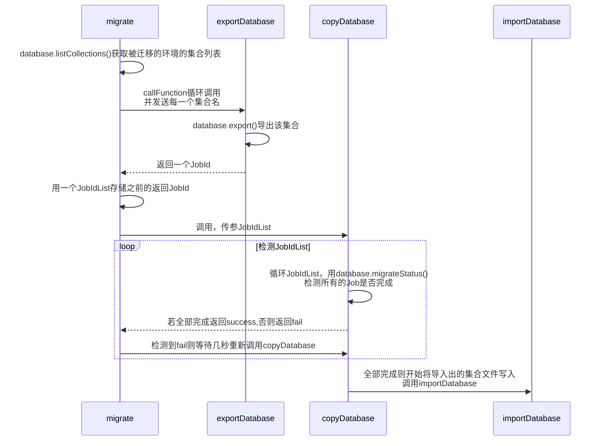

# TCB数据库迁移方案

## 功能介绍

迁移A环境数据库至B环境数据库

## 需要的准备

1. 将文件夹下的函数部署至对应环境
2. 已经创建好的A环境与B环境
3. 如果迁移至的环境在另一个账号下，需要另一个账号的secretID和secretKey，并在init该环境时添加该两个字段
4. 可以直接在云开发控制台进行操作，无需发起调用、
5. 将函数的超时时间调至900秒.

## 函数介绍

### migrate

迁移函数，需部署至**被迁移的环境下**

记得修改demo中的环境ID为自己的环境ID

需主动发起调用，无需参数。

它会调用exportDatabase函数导出数据，并得到一个返回值数组，数据格式大致如下

```json
 [
    {
      "result": {
        "CollectionName": "test2Collection",
        "exportRes": {
          "JobId": 102223492,
          "RequestId": "332f1595-9b64-4a42-a6b3-a0ca1e0b50e5"
        }
      },
      "requestId": "ff84c3dc-d3fa-11eb-bb41-525400be5245"
    },
    {
      "result": {
        "CollectionName": "testCollection",
        "exportRes": {
          "JobId": 102223493,
          "RequestId": "92b8e0b5-e4a9-43bd-b9ef-37e6abca8b83"
        }
      },
      "requestId": "004ba931-d3fb-11eb-a0a6-52540096f86f"
    }
  ]
```

然后会调用copyDatabase，进行迁移

### exportDatabase

导出函数，需部署至**被迁移的环境下**

被migrate调用

### copyDatabase

需部署至**被迁移的环境下**
被migrate调用

```javascript
{
  JobIdList:Array
}
```


​	该函数会发起调用importDatabase，若返回success，则说明迁移成功。

### importDatabase

导入函数，需部署至**迁移目标环境下**

该函数接收CollectionName函数进行集合导入，用户无需主动调用，该函数被copyDatabase调用。


### 时序图




### 完整步骤

1. 调用migrate
2. 等待返回值
3. 前往新环境数据库查看迁移结果


## 注意事项

1. 由于 export 这个接口每秒只能调用一次，所以保险起见，在代码层级上每个集合的导出都间隔一秒。所以migrate这个函数总调用时间会比较长，建议耐心等待（每有一个集合需要约2秒），若集合数量比较大，建议将函数超时时间往上调整。若需要大于900秒，考虑使用云托管实现。
2. 每个文档的导出都是异步的需要时间，得到migrate的返回值之后，请等待一段时候再调用copyDatabase，由于每个文档大小不定所以这个时间不确定，但在copyDatabase中内置了检测函数，如果在未完全导出前发起调用，该函数会停止并提示那一项暂未导出完成，可以放心调用。
3. 返回success后，到控制台查看可能会出现集合已经创建，但文档数量为0的情况，这是因为导入是一个异步事件，创建集合和文档导入并非同时进行的，等待一段时间即可。
4. 文档数为0的集合会被跳过。
5. 若出现系统错误，内部错误等，可以适当调大云函数运行内存。
6. 若migrate函数控制台出現  ESOCKETTIMEDOUT 或其他报错，但其他三个函数均运行正常，那可以忽视，以目标环境数据库数据是否正确迁移为准。
7. 借用了目标环境的云存储作为媒介，若嫌占用大小可以删除，目录为/tmp/db-imports


